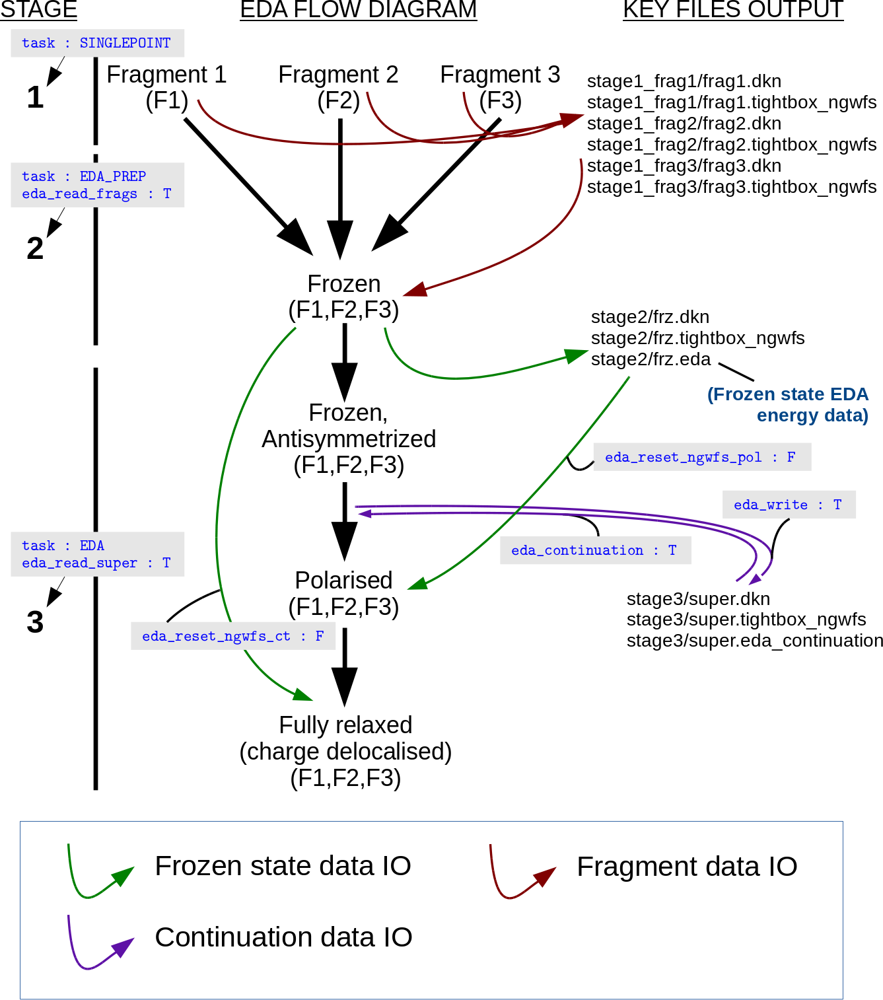

=============================================
Energy Decomposition Analysis (EDA)
=============================================

:Author: Max Phipps, University of Southampton
:Date:   July 2016

Introduction
============

Energy decomposition analysis (EDA) decomposes the interaction energy
(:math:`\Delta E`) of an arbitrary number of non-bonded fragments into
its chemical components [Phipps2015]_. In the case of
the ONETEP EDA [Phipps2016]_, based on the
ALMO [Kaliullin2007]_ and LMO [Su2009]_ EDA
approaches, these components are combined into a frozen density
component (:math:`\Delta E_\mathrm{FRZ}`) term, polarisation
(:math:`\Delta E_\mathrm{POL}`), and charge transfer
(:math:`\Delta E_\mathrm{CT}`) (as per the original ALMO EDA), as,

.. math::

   \begin{aligned}
    \Delta E =& \Delta E_\mathrm{FRZ} + \Delta E_\mathrm{POL} + \Delta E_\mathrm{CT} \quad .\end{aligned}

The frozen density component, representing the interaction of the frozen
densities of the fragments and subsequent antisymmetrization, is further
decomposed into its electrostatics (:math:`\Delta E_\mathrm{ES}`),
exchange (:math:`\Delta E_\mathrm{EX}`), correlation
(:math:`\Delta E_\mathrm{CORR}`), and Pauli repulsion
(:math:`\Delta E_\mathrm{REP}`) terms as,

.. math::

   \begin{aligned}
    \Delta E_\mathrm{FRZ} =& \Delta E_\mathrm{ES} + \Delta E_\mathrm{EX} + \Delta E_\mathrm{CORR} + \Delta E_\mathrm{REP} \quad .\end{aligned}

In the ONETEP implementation, the correlation term is further
partitioned into its frozen (:math:`\Delta E_\mathrm{FRZ-CORR}`) and
Pauli repulsion (:math:`\Delta E_\mathrm{REP-CORR}`) terms as,

.. math::

   \begin{aligned}
    \Delta E_\mathrm{CORR} = \Delta E_\mathrm{FRZ-CORR} + \Delta E_\mathrm{REP-CORR}
   \quad .\end{aligned}

These terms may be recombined to obtain the full correlation energy
term.

The total interaction energy is expressed in its decomposed form as,

.. math::

   \begin{aligned}
    \Delta E =& \Delta E_\mathrm{ES} + \Delta E_\mathrm{EX} + \Delta E_\mathrm{CORR} \nonumber \\
          &+ \Delta E_\mathrm{REP} + \Delta E_\mathrm{POL} + \Delta E_\mathrm{CT} \quad .\end{aligned}

Performing EDA calculations in ONETEP
=====================================

There are two approaches to performing energy decomposition analysis
(EDA) calculations in ONETEP:

#. All-In-One (1S) This approach involves creating a single input file
   with all the necessary information to complete an EDA calculation
   (``TASK EDA``).

   -  Designed for smaller systems.

#. Three-Stage Fragment-to-Supermolecule (3S) This approach involves
   three stages. Firstly NGWF tightboxes and density kernels for the
   fragments are optimised and written to disk. Next the fragment states
   are superposed to the supermolecule to prepare the supermolecule data
   (``TASK EDA_PREP``). Finally the EDA calculation is ran using this
   supermolecule-prepared data (``TASK EDA``).

   -  Designed for larger protein-ligand type EDA calculations.

Both approaches are equivalent and produce identical results. The choice
of whether to use the 1S or 3S approach is usually determined by system
size and parallelisation requirements (please see
section [sect:ParallelisationReq]). Further details of calculations
using these two approaches and a list of the EDA-specific keywords and
descriptions are provided below:

All-in-One
----------

The all-in-one (1S) approach is the default EDA calculation
configuration, and is ran by simply setting the ``TASK`` keyword to
``EDA``. In addition to the standard input keywords and blocks, the
``EDA_IATM`` block is necessary to perform ONETEP EDA calculations. This
block defines the fragment atoms (referenced to the atom definitions in
``POSITIONS_ABS``), and the fragment charges. Atoms of the supermolecule
are arranged in the ``POSITIONS_ABS`` block by concatenation of the
fragment atoms, using their nuclear coordinates found in the
supermolecule. For example, if a supermolecule system comprising the
fragments :math:`H_2O` (atoms 1 to 3), :math:`OH^-` (atoms 4 to 5), and
:math:`Na^+` (atom 6) is defined in the ``POSITIONS_ABS`` block,

::

    %block POSITIONS_ABS
      O      17.16973430    19.79077059    17.26422010
      H      16.00000000    19.22196603    16.00000000
      H      18.57568311    18.64371289    17.26799954
      O      21.16270452    17.46075058    18.04467287
      H      22.06598884    16.00000000    17.45886087
      Na     20.73940810    20.59012052    20.33500884
    %endblock POSITIONS_ABS

then the fragment data necessary for the EDA calculation is input as,

::

    %block EDA_IATM
      !N_at  Charge
       3     +0
       2     -1
       1     +1
    %endblock EDA_IATM

Three-Stage
-----------

The 3S EDA has been developed to work easily with EDA directory
structures, with fragment calculations being performed in separate
folders. These data directories are specified in the input file using
the ``EDA_FRAG`` and ``EDA_SUPER`` blocks as will be discussed below. In
our EDA calculation example of a supermolecule comprising three
fragments provided below, the following directory structure is used:

.. math::

   \begin{aligned}
       &\left.
       \begin{array}{ll}
         \mathrm{./STAGE1/FRAG01/} \\
         \mathrm{./STAGE1/FRAG02/} \\
         \mathrm{./STAGE1/FRAG03/}
       \end{array}
       \right\} \mathrm{Fragment\ calculations} \nonumber \\
       &\left. \mathrm{./STAGE2} \right\} \mathrm{Supermolecule\ preparation\ calculation} \nonumber \\
       &\left. \mathrm{./STAGE3} \right\} \mathrm{Supermolecule\ EDA\ calculation} \nonumber\end{aligned}

It is noted that the user is not limited to three fragments , and that
the folder names given above are for example purposes only and any
folder and input file names may be used.

In all three stages, it is necessary to ensure that the system
parameters are kept at constant values. For example, it is unwise to
modify the NGWF radii or box sizes between the calculation stages. It is
also important to ensure atomic orderings in the input file are
consistent, *i.e.* that the orderings of atoms within each of the
fragments do not change between the different calculation stages.

Stage 1
~~~~~~~

The first stage simply involves the user writing converged fragment data
to disk. For each fragment comprising the supermolecule, a separate
input file is constructed with the following parameters set:

::

    write_denskern T
    write_tightbox_ngwfs T
    TASK SINGLEPOINT

Running these calculations will result in fragment ‘.dkn’ and
‘.tightbox\_ngwfs’ files being written to disk. In our example, the
three fragment calculation are ran in the directories
``STAGE1/FRAG01/``, ``STAGE1/FRAG02/``, and ``STAGE1/FRAG03/`` using the
input filenames ‘frag01.dat’, ‘frag02.dat’, and ‘frag03.dat’ for the
respective fragments 1, 2, and 3.

Stage 2
~~~~~~~

The input file for the second stage is prepared by including the
parameters ``EDA_READ_FRAGS T`` and ``TASK EDA_PREP``. Running ONETEP
with this input file will result in the converged fragment data being
loaded in and combined to produce the supermolecule complex data
(‘.eda’, ‘.dkn’ and ‘.tightbox\_ngwfs’ files) necessary for stage three.
These fragment files’ names are set via the ``EDA_FRAG`` block, e.g. for
a three fragment system:

::

    %block EDA_FRAG
      frag1prefix
      frag2prefix
      frag3prefix
    %endblock EDA_FRAG

where ``frag1prefix``, ``frag2prefix`` and ``frag3prefix`` are the
filename prefixes that will result in loading of the ‘.dkn’ and
‘.tightbox\_ngwfs’ files for the three fragments that were converged in
stage one. In our example, we assume the second stage calculation is
performed in the directory ``STAGE2/`` with the input filename
‘stage2.dat’. In this case the block would appear in the input file as,

::

    %block EDA_FRAG
      ../STAGE1/FRAG01/frag01
      ../STAGE1/FRAG02/frag02
      ../STAGE1/FRAG03/frag03
    %endblock EDA_FRAG

Stage 3
~~~~~~~

The third stage is performed by including the parameters
``EDA_READ_SUPER T`` and ``TASK EDA`` in the input file. As described
earlier for the 1S approach, it is necessary for the user to define the
fragment atoms and charges using the ``EDA_IATM`` block. On running
ONETEP with this input file, the ‘.dkn’, ‘.tightbox\_ngwfs’ and ‘.eda’
files for the supermolecule prepared from stage two will be loaded.
These files’ names are set via the ``EDA_SUPER`` block, e.g.

::

    %block EDA_SUPER
      supermoleculeprefix
    %endblock EDA_SUPER

where ``supermoleculeprefix`` is the filename prefix that will result in
loading of the ‘supermoleculeprefix.dkn’,
‘supermoleculeprefix.tightbox\_ngwfs’, and ‘supermoleculeprefix.eda’
files. In our example, where the third stage calculation is performed in
the directory ``STAGE3/`` with the input filename ‘stage3.dat’, the
block would appear as,

::

    %block EDA_SUPER
      ../STAGE2/stage2
    %endblock EDA_SUPER

Continuation
============

Continuation of supermolecule-stage EDA calculations (stage three of the
3S EDA) is controlled using the ``EDA_CONTINUATION`` keyword.
Continuation files are written to disk within the current working
directory when the value of the ``EDA_WRITE`` logical keyword is set to
true, and continuation files are read by setting the
``EDA_CONTINUATION`` logical keyword to true.

It is recommended that the storage of continuation data should be kept
separate to the ``TASK EDA_PREP`` task calculation data of stage two.
This is achieved by performing the stage three calculation in a separate
directory to the stage two calculation. This is because the EDA data
produced from the ``TASK EDA_PREP`` calculation produces a reference to
the frozen state which the NGWFs and density kernel will be reset to in
a large proportion of EDA calculation cases.

EDA schematic
=============

An example EDA calculation and directory structure is provided in :numref:`exampleEDA`.

.. _exampleEDA:

   arrows).

   An example 3S EDA calculation (data IO flows are represented by
   arrows).

Additional functionality
========================

Further details of the EDA functionalities is given below:

Fragment-wise polarisations
---------------------------

| *Please note that the following functionality is developmental and is
  subject to change.*
| It is possible to obtain polarisation energies for each of the
  fragments by ‘freezing’ the electronic density during the SCF-MI
  optimisation. The number of additional polarisation calculations
  required to perform this is equal to the number of fragments in the
  system. This functionality is activated using the
  ``EDA_FRAG_ISOL_POL`` logical keyword. Also computed is a ‘higher
  order’ polarisation contribution that quantifies the difference
  between the individual fragment polarisation total and the full
  polarisation energy, i.e.

  .. math::

     \begin{aligned}
      \Delta E_\textrm{POL,HO} = \sum_{A\in \textrm{X}}^{N_\textrm{frag}} \Delta E_\textrm{POL(\textit{A})} - \Delta E_\textrm{POL}\end{aligned}

| where :math:`\Delta E_\textrm{POL,HO}` is the higher order
  polarisation contribution, :math:`N_\textrm{frag}` is the number of
  fragments, :math:`\Delta E_\textrm{POL(\textit{A})}` is the
  polarisation energy for fragment :math:`A` that constitutes the
  supermolecule :math:`\textrm{X}`, and :math:`\Delta E_\textrm{POL}` is
  the polarisation energy on polarising all fragments simultaneously.

Fragment pair-wise delocalisations
----------------------------------

| *Please note that the following functionality is developmental and is
  subject to change.*
| This functionality is activated using the ``EDA_FRAG_ISOL_CT`` logical
  keyword.

It is possible to calculate fragment pair delocalisation energies by
combining fragments within the SCF-MI optimisation. For example, if we
consider a system of interacting :math:`(H_2O)_3`, the delocalisation
between any two water molecules is calculated by subtracting the SCF-MI
energy of a combined :math:`(H_2O)_2` ‘fragment’ interacting with
:math:`H_2O` from the SCF-MI energy of the system with the
:math:`(H_2O)_2` ‘fragment’ partitioned into its two :math:`H_2O`
constitutents.

Density visualisation
---------------------

Obtaining electron density (ED) files for visualisation of the EDA
frozen, polarisation and fully electronically relaxed states can be done
using the ``WRITE_DENSITY_PLOT`` logical keyword. The output densities
are identified by the ‘\_ed\_’ filename string.

+--------------------------------------------------+------------------------------------------------------------------------------------------+
| Filename String                                  | Summary                                                                                  |
+==================================================+==========================================================================================+
| *xxx*\ \_eda\_frzidem\_ed\_density.cube          | The ED of the frozen state.                                                              |
+--------------------------------------------------+------------------------------------------------------------------------------------------+
| *xxx*\ \_eda\_pol\_\ *iii*\ \_ed\_density.cube   | The ED of fragment *iii* electronically polarised in the field of all other fragments.   |
+--------------------------------------------------+------------------------------------------------------------------------------------------+
| *xxx*\ \_eda\_pol\_ed\_density.cube              | The ED of the fully electronically polarised state.                                      |
+--------------------------------------------------+------------------------------------------------------------------------------------------+
| *xxx*\ \_eda\_relaxed\_ed\_density.cube          | The ED of the fully electronically relaxed state.                                        |
+--------------------------------------------------+------------------------------------------------------------------------------------------+

Table: The EDA electron density (ED) filename extension descriptions
(filename root is denoted by *xxx*).

Visualisation of the density changes during the EDA polarisation and
charge transfer processes via electron density difference (EDD)
calculations are obtained using the ``EDA_DELTADENS`` logical keyword.
The output densities are identified by the ‘\_edd\_’ filename string.

+-------------------------------------------------------+----------------------------------------------------------------------------------------------------------------------------+
| Filename String                                       | Summary                                                                                                                    |
+=======================================================+============================================================================================================================+
| *xxx*\ \_pol\_\ *iii*\ \_edd\_density.cube            | The electronic polarisation EDD of fragment *iii* in the field of all other fragments.                                     |
+-------------------------------------------------------+----------------------------------------------------------------------------------------------------------------------------+
| *xxx*\ \_eda\_pol\_higher\_order\_edd\_density.cube   | The higher order electronic polarisation EDD (of the individual fragment-polarised states to the fully polarised state).   |
+-------------------------------------------------------+----------------------------------------------------------------------------------------------------------------------------+
| *xxx*\ \_eda\_pol\_edd\_density.cube                  | The fully electronically polarised EDD state.                                                                              |
+-------------------------------------------------------+----------------------------------------------------------------------------------------------------------------------------+
| *xxx*\ \_eda\_ct\_edd\_density.cube                   | The charge transfer EDD.                                                                                                   |
+-------------------------------------------------------+----------------------------------------------------------------------------------------------------------------------------+

Table: The EDA electron density difference filename extension
descriptions (filename root is denoted by *xxx*).

Both ED and EDD functionalities are compatible with fragment-specific
(see previous section) EDA calculations.
Note: electron density differences are currently not computable when the
``EDA_CONTINUATION`` keyword is set to true. In this case, the edd\_cube
utility may be used along with the ED cube files produced using the
``WRITE_DENSITY_PLOT`` logical keyword to calculate EDD files
independently of ONETEP (see ‘Additional utilities’ section).

Parallelisation
===============

Parallelisation requirements
----------------------------

The 1S calculation has a parallelisation strategy with restricted
maximum possible number of MPI processes, :math:`{N_\mathrm{proc,max}}`,

.. math::

   \begin{aligned}
     {N_\mathrm{proc,max}}= \mathrm{min}\left[ {N_\mathrm{at}(\mathrm{A})}, {N_\mathrm{at}(\mathrm{B})} \right]\end{aligned}

where :math:`A` and :math:`B` are fragments comprising a supermolecule
:math:`AB`. For example in the case of a water dimer
:math:`{N_\mathrm{proc,max}}= 3`.

The 3S EDA allows the user to take full advantage of the parallelisation
strategy during the supermolecule stage three, i.e.

.. math::

   \begin{aligned}
    {N_\mathrm{proc,max}}= \mathrm{min}\left[ {N_\mathrm{at}(\mathrm{A})}, {N_\mathrm{at}(\mathrm{B})} \right] &|_{{\mathrm{S}}=1,2} \\
    {N_\mathrm{proc,max}}= {N_\mathrm{at}(\mathrm{AB})} &|_{{\mathrm{S}}=3}\end{aligned}

where :math:`{\mathrm{S}}` is the stage number. For example in the case
of a water dimer :math:`{N_\mathrm{proc,max}}= 6` during the
supermolecule stage three (:math:`{\mathrm{S}}`\ =3).

ScaLAPACK
---------

The current EDA implementation requires explicit calculation and
manipulation of the fragment MO eigenvectors. The ONETEP EDA
implementation is compatible with the LAPACK [Anderson1999]_
and ScaLAPACK [Blackford1997]_ packages, and has been
interfaced to the DSYGVX and PDSYGVX eigensolvers. Compilation with the
ScaLAPACK solver is enabled at compilation time using the -DSCALAPACK
flag. Use of this package provides significant speed-ups by parallelised
computation of the eigenvectors required.

The threshold tolerance to which the eigenvectors are orthogonalised is
specified by the ``eigensolver_abstol`` keyword. It has been observed
that the eigensolver may require tighter than the default thresholds.
This parameter can be modified in the input, e.g.
``eigensolver_abstol = 1.0E-12``.

Additional utilities
====================

utils/edd\_cube.F90
    This utility calculates the electron density difference between two
    ‘.cube’ volumetric data files Usage: ./edd\_cube cubein1 cubein2
    cubeout, where *n*\ (cubeout) = *n*\ (cubein1) - *n*\ (cubein2)

[Phipps2015] Maximillian J. S. Phipps, Thomas Fox, Christofer S. Tautermann, and Chris-Kriton Skylaris. Energy decomposition analysis approaches and their evaluation on prototypical protein-drug interaction patterns. *Chem. Soc. Rev.*, 44:3177–3211, 2015.

[Phipps2016] Maximillian J. S. Phipps, Thomas Fox, Christofer S. Tautermann, and Chris-Kriton Skylaris. Energy decomposition analysis based on absolutely localised molecular orbitals for large-scale density functional theory calculations in drug design. *(Submitted)*, 2016.

[Khaliullin2007] R. Z. Khaliullin, E. A. Cobar, R. C. Lochan, A. T. Bell, and M. Head-Gordon. *J. Phys. Chem. A*, 111:8753–8765, 2007.

[Su2009] Peifeng Su and Hui Li. Energy decomposition analysis of covalent bonds and intermolecular interactions. *J. Chem. Phys.*, 131(1):014102, 2009.

[Anderson1999] E. Anderson, Z. Bai, C. Bischof, S. Blackford, J. Demmel, J. Dongarra, J. Du Croz, A. Greenbaum, S. Hammarling, A. McKenney, and D. Sorensen. *LAPACK Users' Guide*. Society for Industrial and Applied Mathematics, Philadelphia, PA, third edition, 1999.

[Blackford1997] L. S. Blackford, J. Choi, A. Cleary, E. D’Azevedo, J. Demmel, I. Dhillon, J. Dongarra, S. Hammarling, G. Henry, A. Petitet, K. Stanley, D. Walker, and R. C. Whaley. *ScaLAPACK Users' Guide*. Society for Industrial and Applied Mathematics, Philadelphia, PA, 1997.
