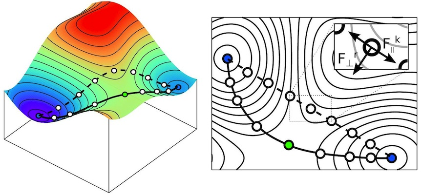

============================================================================================
Nudged Elastic Band Transition State Searching and the Image-Parallel Running Mode
============================================================================================

:Author: Kevin Duff, University of Cambridge

:Date: 2018

NEB Method
==========

The Nudged Elastic Band (NEB) method is a systematic approach to
transition state searching. A brief overview will be provided here; for
a more detailed description see [Jonsson1998]_.

Overview
--------

Tools such as geometry optimization make determining the properties and
relative energies of products and reactants relatively straightforward.
Of equal importance to understanding a reaction or diffusion problem is
the transition state (TS) - the highest-energy point on the minimum
energy path (MEP) connecting the reactant and product in configuration
space. Unfortunately determining the TS is not a simple local
minimization problem, but instead it requires a determination of the MEP
from the set of paths that connect the reactant and product. Several
approaches that attempt to approximate the TS given a set of assumptions
about the energy landscape exist, such as LST/QST. NEB attempts to offer
a systematic determination of the TS through a local optimization of the
MEP from an initial guess.

Theory
------

An elastic band method connects the reactant and product with a chain of
beads in configuration space connected to their immediate neighbors with
springs of natural length :math:`0`. This chain is then relaxed with the
reactant and product held fixed and each bead on the chain feeling the
forces from the potential energy surface as well as the springs.

Unfortunately, this approach runs into two immediate issues. The spring
force perpendicular to the path works to pull the chain away from the
correct MEP, leading to a poor approximation of the TS, and the force
from the potential energy surface tangent to the path pushes beads to
lower energy areas, whereas the goal is to sample the highest-energy
point on the path. Varying the spring constant can reduce one issue
while exacerbating the other and there is no systematic way to sample
the highest point of the correct MEP.

The nudged elastic band approach is to project out the problematic
components of the spring and PES force, ‘nudging’ the chain back onto
the MEP. That is, each bead feels only the component of the force due to
the potential energy surface perpendicular to the path tangent and that
of the spring force parallel to the path tangent. The former relaxes the
chain onto the MEP and the latter evenly distributes the images along
the path. Using this approach the beads will lie strictly on the MEP
regardless of bead count assuming an accurate approximation to the path
tangent at each point.

As with any local minimization, the final path depends on the initial
guess and is not guaranteed to be the global MEP. Care should be taken
in complicated reactions or diffusions - in particular a reaction
passing through several stable intermediates might be broken into a
number of separate NEB calculations. More control over the initial path
guess may be implemented in the future.

.. _NEB_example:
 [Cordier2018]_.

   Cartoon of a NEB path initialization by linear interpolation and final sampling of the MEP. Each image only feels the component of the spring force parallel to the path tangent and the real force perpendicular to the path tangent. Image source & copyright [Cordier2018]_.

Tangent Approximation
---------------------

Because the MEP is approximated by a series of beads, the path tangent
must be approximated. A number of valid approximations exist - ONETEP
uses an improved-stability approximation described
in [Henkelman2000]_. This approach reduces kinks
in the path that arise in some systems and is generally stable.
Equation :eq:`improved_tangent_1` describes the tangent
:math:`\boldsymbol{\tau}_i` approximated at bead :math:`i` with energy
:math:`E_i`, where
:math:`\boldsymbol{\tau}_i^+=\mathbf{R}_{i+1}-\mathbf{R}_{i}` and
:math:`\boldsymbol{\tau}_i^-=\mathbf{R}_{i}-\mathbf{R}_{i-1}`, in cases
where the neighboring beads’ energies make a strictly increasing or
decreasing series. If that’s not the case,
Equation :eq:`improved_tangent_2` gives the tangent approximation,
where
:math:`\Delta V_i^\mathrm{max}=\max{\left(\left|V_{i+1}-V_i\right|,\left|V_{i}-V_{i-1}\right|\right)}`
and
:math:`\Delta V_i^\mathrm{min}=\min{\left(\left|V_{i+1}-V_i\right|,\left|V_{i}-V_{i-1}\right|\right)}`.

.. math::
   :label: improved_tangent_1

   \boldsymbol{\tau}_i=
   \begin{cases}
   \boldsymbol{\tau}_i^+, & V_{i+1} > V_i > V_{i-1} \\
   \boldsymbol{\tau}_i^-, & V_{i-1} > V_i > V_{i+1} \\
   \end{cases}

.. math::
   :label: improved_tangent_2
   
   \boldsymbol{\tau}_i=
   \begin{cases}
   \boldsymbol{\tau}_i^+ V_i^\mathrm{max} + \boldsymbol{\tau}_i^- V_i^\mathrm{min}, & V_{i+1} > V_{i-1} \\
   \boldsymbol{\tau}_i^+ V_i^\mathrm{min} + \boldsymbol{\tau}_i^- V_i^\mathrm{max}, & V_{i-1} > V_{i+1}
   \end{cases}

Climbing-Image NEB
------------------

NEB tries to ensure that the beads are equally spaced along the path.
This doesn’t guarantee good sampling of the transition state, which is
the most important part of the path. The TS energy can be interpolated
if there are enough beads on the path, but the climbing image addition
to NEB (CI-NEB) works to move a selected bead near the TS to exactly
sample the TS. Once enabled, the highest-energy bead doesn’t feel the
NEB spring force and moves in a modified potential energy surface, where
the components perpendicular to the path are essentially mirrored. This
transforms a saddle point region of the PES into a basin with a minimum
at the transition state. That bead is then minimized in this potential
and the rest of the chain in the normal way. This is generally useful
when the MEP is being sampled well, though it does make assumptions
about the shape of the PES near the saddle point. More details can be
found in [Henkelman2000-2]_.

Image-Parallel Implementation in ONETEP
=======================================

Each NEB iteration each bead requires a local energy and force
calculation, as well as knowledge of the locations and relative energies
of its neighbors for spring force calculation and tangent approximation.
For this reason, and for other simulations that involve multiple
communicating but largely independent subsystems, an alternate running
mode was developed for Onetep that allows multiple simulations to exist
in the same MPI world. Each simulation, or image, can progress
independently but special communicators have been set up to allow
communication between them. In the case of NEB, each Onetep image
controls one bead in the chain.

Important to note is that when running in image-parallel mode the
default communicator for things like comms operations is changed from
``mpi_comm_world`` to ``comms`` mod’s ``pub_image_comm``, a communicator
between all processes in one Onetep image. ``comms`` mod’s
``pub_imroots_comm`` is a communicator between the root processes of
each image, allowing images to communicate and allowing tasks to give
each image something different to do. Additionally, each image opens its
own new file ``{rootname}{image_num}.onetep`` to write ``stdout`` to,
with the original ``stdout`` being available through ``image_comms``
mod’s ``orig_stdout``. Each image similarly maintains its own set of
restart files, properties files, etc, and nothing special has to be done
to restart image-parallel calculations.

Normally the number of MPI processes specified at runtime must be
divisible by the number of images requested. Advanced configuration
allows images to be different sizes, in case a task needs to be able to
perform calculations that aren’t necessarily comparable in cost.

Commands
========

NEB Keywords
------------

NEB can be enabled by setting ``task : tssearch`` and
``tssearch_method : neb`` in the ONETEP input file. ONETEP must be
executed with enough MPI processes to support the number of images
requested. Several geometry optimization keywords will apply to NEB as
the chain optimization is threaded through the geometry optimizer.

The reactant is taken from the atomic positions specified in the input
file. A product section must also be provided through e.g.
``%block positions_abs_product``. A guess intermediate can also be
provided, in which case the NEB chain will place beads on the linear
interpolation from reactant to intermediate and intermediate to product.
This can be specified with e.g. ``%block positions_abs_intermediate``.

Basic Usage
-----------

-  ``num_images: n`` [Intermediate integer, default ``1``\ ]. Defines the
   number of Onetep instances that should run in the simulation and
   enables image-parallel mode. In NEB, this is also the number of beads
   in the chain.

-  ``{reactant,product}_energy`` [Intermediate real physical, default
   ``N/A``\ ] and ``{reactant,product}_rootname`` [Intermediate string,
   default ``NONE``\ ]. Both the reactant and product energies must be
   known at the start of the calculation. The energy can be specified
   either as a raw total energy or as a rootname from which Onetep can
   read the tightbox NGWF and density kernel (and, in EDFT, Hamiltonian)
   files from a previous calculation, or they can be calculated from
   scratch if neither is specified. The reactant and product energies
   needn’t be specified in the same way.

Additional Controls
-------------------

-  ``neb_ci_delay: n`` [Intermediate integer, default ``-1``\ ]. Defines
   the number of BFGS steps the chain should take before enabling a
   climbing image. Negative numbers disable the climbing image entirely.

-  ``neb_print_summary`` [Intermediate boolean, default ``.true.``\ ]. If
   ``.true.``, Onetep will print NEB convergence information as well as
   a summary of the reduced reaction coordinate and relative energy of
   each bead after each NEB step to the original stdout.

Convergence
~~~~~~~~~~~

Currently the calculation is considered converged when each bead is
individually converged. These tolerances are used instead of the geomopt
ones.

-  ``tssearch_energy_tol`` [Expert real physical, default
   ``1.0e-5 Ha``\ ]. Convergence tolerance on change in bead energy in one
   NEB step.

-  ``tssearch_force_tol`` [Expert real physical, default
   ``0.005 Ha/bohr``\ ]. Convergence tolerance on max force on any atom.

-  ``tssearch_disp_tol`` [Expert real physical, default
   ``0.01 bohr``\ ]. Convergence tolerance on displacement of any atom in
   one NEB step.

Other Image-Parallel Keywords
-----------------------------

-  ``image_sizes`` [Expert string, default ``DEFAULT``]. If specified
   in the input file, a string of the format ``i|j|k|l|m|...`` can be
   used to individually size the images in an image-parallel run. The
   number of sections specified should be equal the number of images in
   the run and the sum of the image sizes should be equal the number of
   MPI processes specified at runtime.

[Jonsson1998] H. Jónsson, G. Mills, and K. W. Jacobsen. *Chapter 16: Nudged elastic band method for finding minimum energy paths of transitions*, Classical and Quantum Dynamics in Condensed Phase Simulations Part II.

[Henkelman2000] G. Henkelman, and H. Jónsson. *Improved tangent estimate in the nudged elastic band method for finding minimum energy paths and saddle points*. J. Chem. Phys. **113**, 9978 (2000).

[Henkelman2000-2] G. Henkelman, B. P. Uberuaga, and H. Jónsson. *A climbing image nudged elastic band method for finding saddle points and minimum energy paths*. J. Chem. Phys. **113**, 9901 (2000).

[Cordier2018] Copyright P. Cordier http://umet.univ-lille.fr/Projets/RheoMan/en/to-learn-more-about/nudged-elastic-band.php Accessed 21 April 2018.
