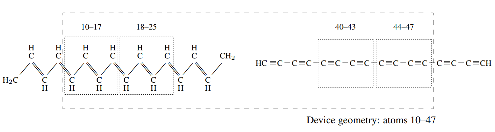

=====================================
Electronic transport calculations
=====================================

:Author: Robert A. Bell, University of Cambridge (``rab207@cam.ac.uk``)

Introduction
============

This document describes the use of the electronic transport
functionality that is implemented in the ONETEP
code [Bell2014]_. The implementation computes the
ballistic Landauer-Büttiker conductance at zero bias through a device
and associated properties using electronic structure derived from
density functional theory (DFT). The calculation proceeds as a
post-processing step after a ground-state single-point calculation.

This document focuses on the practical aspects of setting up
calculations; a detailed technical explanation of the method can be
found in [Bell2014]_. For a detailed discussion
of the Landauer-Büttiker formalism and conductance derived from DFT see
[DiVentra2008]_, [Datta1995]_.

I first briefly outline what is being calculated, I then give an example
calculation and suitable input parameters, and then finally a full input
parameter listing is given.

What is being calculated?
=========================

The transport calculation determines the ballistic conductance through a
device. Current can flow between two leads via the connection made by
the central scattering region. We will refer to this geometry as the
*device* geometry.

Under the Landauer formalism, the contribution to the conductance
between two leads (indexed :math:`i` and :math:`j`) from electrons with
energy :math:`E` is given by

.. math:: G_{ij}(E) = \frac{2e^2}{h} T_{ij}(E)

where :math:`T_{ij}(E)` is the transmission function. The transmission
function is the central quantity to the Landauer-Büttiker conductance
and is calculated using a Green’s function technique:

.. math::
   :label: caroli

      T_{ij}(E) = \mathrm{tr}\Big[\Gamma_i(E)\;G_{\rm d}(E)\;\Gamma_j(E)\;G_{\rm d}^{\dagger}(E)\Big],

.. math::
   :label: greenf
	   
      G_{\rm d}(E) = \big[ (E+i\eta)S_{\rm d} - H_{\rm d} - \Sigma(E)\big]^{-1},

where :math:`H_{\rm d}`, :math:`S_{\rm d}` the
Hamiltonian and overlap matrices for the device, and :math:`\eta` is an
infinitessimal positive energy that selects the retarded response of the
Green’s function :math:`G_{\rm d}`. The interaction with the
semi-infinite leads accounted for through the lead self-energies
:math:`\Sigma_j`, with
:math:`\Sigma = \sum_j \Sigma_j`. The coupling
matrices are defined as
:math:`\Gamma_j = i(\Sigma_j - \Sigma_j^{\dagger})`.

From the Green’s function, one may also calculate the density of states
within the device region as

.. math:: \mathcal{N}(E) = -\frac{1}{\pi}{\mathrm{Im}}\mathrm{tr}\big[G_{\rm d}(E) S_{\rm d}\big].

Further post processing steps may be performed to determine the
eigenchannels. [Bell2014]_, [Paulsson2007]_

Building the device
===================

The principal quantities required in Eqns. :eq:`caroli` and :eq:`greenf`
are the device Hamiltonian and overlap matrices, and the lead self
energies. The approach adopted in this implementation is to extract
these matrix elements from the ground-state electronic structure
obtained after a standard single-point calculation. This approach
corresponds to a non-self consistent calculation of the transmission
spectrum and device electronic structure. Note that this procedure
differs from self consistent approaches, such as e.g.
[Brandbyge2002]_, where the open boundary conditions of
the leads are treated explicitly. At zero bias, however, both methods
produce equivalent results yet the non-self consistent approach is often
far less computationally expensive.

A detailed description of the matrix element extraction procedure, as
implemented in the ONETEP code, is given in [Bell2014]_
which should be referred to in the first instance. Summarising briefly,
to calculate the transmission through any device geometry the user must
construct another *auxilliary simulation* structure that contains this
device. The *only* electronic structure that is calculated is that of
the auxilliary simulation geometry.

The structure of the auxilliary simulation geometry must take a specific
form, consisting of the central region that connects the leads and a
bulk-like region for each lead. Each lead region must have a local
electronic structure that is bulk-like, and be large enough that it
contains at least two principal layers of the bulk lead structure. [1]_
The device geometry is then defined as all the atoms contained within
the central region and the two lead principal layers for each lead.

For a device connecting two leads, the device Hamiltonian then looks
like

.. math::

   H_{\rm d} = 
      \begin{pmatrix}
         \mathbf{h}_{00,L}    & \mathbf{h}_{0,L}  & \cdot                & \cdot                  & \cdot              \\
         \mathbf{h}^\dagger_{01,L} & \mathbf{h}_{00,L}  & \mathbf{h}_{LC}    & \cdot                  & \cdot              \\
         \cdot                  & \mathbf{h}^\dagger_{LC} & \mathbf{h}_{C}     & \mathbf{h}_{CR}      & \cdot              \\
         \cdot                  & \cdot                & \mathbf{h}^\dagger_{CR} & \mathbf{h}_{00,R}    & \mathbf{h}_{01,R}\\
         \cdot                  & \cdot                & \cdot                & \mathbf{h}^\dagger_{01,R} & \mathbf{h}_{00,R}
      \end{pmatrix}

where :math:`\mathbf{h}_{00,L}` is the on-site Hamiltonian block for
the left lead principal layer, :math:`\mathbf{h}_{01,L}` is the
coupling Hamiltonian between principal layers, :math:`\mathbf{h}_{LC}`
is the coupling block between the left lead principal layer and the
central region, and :math:`\mathbf{h}_{C}` is the on-site block for
the central region. As a result of the localisation of the NGWFs the
device Hamiltonian takes the block tri-diagonal form, with zero matrix
blocks denoted by a dot. An equivalent form is found for the device
overlap matrix.

The lead self energies are computed using the
:math:`\mathbf{h}_{00,L}, \mathbf{h}_{01,L}` blocks via the method
of Ref. [Lopez-Sancho1985]_. Note that these blocks are
contained within the device Hamiltonian :math:`H_{\rm d}`.

The device matrix elements are extracted from the electronic structure
of the auxilliary simulation geometry. This procedure is entirely
automated, however, and the user need only supply a list of atoms that
define the device, and the subsets of these atoms that form the two
principal layers for each lead. *i.e.* for an :math:`n`-lead device, the
user must define :math:`2n+1` sets of atoms.

A single limitation of the implementation is that the two principal
layers of any lead must be the exact same structure *with atoms in the
same relative ordering*. This ensures that the lead self energies are
computed correctly. The implementation will not do this automatically,
however a check is performed to ensure that it is true before the
calculation is started.

For a more detailed discussion of the procedure for extracting matrix
elements see [Bell2014]_.

Setting up a calculation
========================

The best way to explain how to set up an input is through an example,
and here I give an explanation of the parameters required to calculation
the transmission between two semi-infinite organic wires. Specifically,
I will explain the setup for calculating the tunnelling current between
a polyacetylene wire and polyyne wire where each wire is semi-infinite
and terminated with a hydrogen atom. I will, however, assume that the
user knows how to successfully converge the standard ONETEP single-point
calculation.

A suitable auxiliary simulation geometry is shown in schematic form in Fig. :numref:`fig1`,
consisting of molecular fragments of the polyacetylene and polyyne wires
located in vacuum. This entire geometry contains 52 atoms. I will assume
that these atoms are ordered in the input file by their position from
left to right.

Suppose that I wish to calculate the transmission spectrum in a
:math:`\pm 2eV` window about the Fermi energy with a resolution
of :math:`0.01eV`. The transport specific input parameters are as
follows:

::

       
       etrans_lcr               : T
       etrans_bulk              : T
       etrans_emin              : -2.0 eV
       etrans_emax              :  2.0 eV 
       etrans_enum              :  401
       etrans_calculate_lead_mu : T
       
       %block etrans_setup
         10  47
       %endblock etrans_setup

       %block etrans_leads
         10  17  18  25  unit_cells=2
         44  47  40  43  unit_cells=2
       %endblock etrans_leads
       
       ! rest of input file...

The first six lines indicate that we wish to calculate the transmission
between the two leads (the LCR transmision, see
[Bell2014]_), and the maximum transmission that
could be injected by each lead (the bulk transmission), and the energy
range the calculation will be performed over. I am also indicating that
I want to calculate the lead band structures.

The first block after these six lines is the ``etrans_setup`` block which
states that all atoms between atom :math:`10` and :math:`47` (inclusive,
and in the order found in the input file) are defined as the device
geometry. This region is given by the long-dashed box in . Atoms outside
this set will not be included in the transmission calculation, but will
be used when calculating the ground-state electronic structure.

The final block is the ``etrans_leads`` block which gives the subset of
these device atoms that define the two principal layers for each lead.
Each lead is given on a separate line, with the first pair of indices
defining the principal layer furthest from the central region, and the
second pair the principal layer closest to the central region. Note that
this ordering of the two principal layers is important. Finally, I have
indicated that each principal layer is in fact two primitive unit cells
of the lead structure by using ``unit_cells=2``. This tells ONETEP to symmetrise
the lead matrix elements to reflect this periodicity. The atoms
contained within each principal layer are indicated in by dotted boxes.

This choice of auxilliary simulation geometry tries to ensure that the
lead principal layers are sufficiently far from the ends of the
molecular fragments that the local electronic structure within the lead
is bulk-like. This has required the use of buffer atoms (atoms 1–9 and
48–52) that are not included in the transport calculation. Some buffer
has also been used between the principal layers and the central
tunnelling gap (atoms 26–34 and 35–39) for the same reason. In practice,
the size of this buffer is probably too small and the lead principal
layers will not be well converged to the bulk. This can be tested by
comparing the band structures of each lead to the corresponding bulk
band structure for that lead, which can be calculated separately. If the
lead band structure is not converged, the size of the buffer region
should be increased.

.. _Fig1:

   A possible auxilliary simulation geometry for calculating the tunnelling transmission between a polyacetylene wire and a polyyne wire. The atoms appear ordered in the input file by their position from left to right.
	   

Computational scaling
=====================

The dominant computationally-intensive task in the transport routines is
the computing of the device Green’s function. This calculation is
performed using an efficient block tri-diagonal Gaussian-elimination
algorithm [Petersen2008]_. This algorithm results in memory
usage and operation counts that scale linearly in the number of atoms.
The pre-factor to this scaling depends on the precise geometry of the
device: the more one-dimensional a device (i.e. the fewer NGWFs that
overlap), the lower this pre-factor.

Information on parallelisation
==============================

The calculation of transmission coefficients is parallelised over the
energy points, with each MPI process performing the calculation in
serial. No internal communications are necessary making the routines
scale perfectly with the number of MPI processes. However, as all
matrices must be replicated on each MPI process, the memory requirements
can be large. On entering the transport routines but prior to starting
the calculation, an estimate of the additional memory required by the
transport routines is printed. Note that this estimate does not include
the memory required by the rest of the ONETEP routines.

Parallelisation using OpenMP threading is not currently available.
However, if the code is linked against Intel’s Math Kernel Library
(MKL), the linear algebra routines can make use of multi-threading
within this library. To do this, the flag ``-DMKLOMP`` must be included
during compilation, and the number of threads can be set from the input
file using ``threads_num_mkl``.

The calculation of the eigenchannels can only be parallelised if linking
against the ScaLAPACK library to make use of parallel dense algebra. To
enable this, the flag ``-DSCALAPACK`` must be included at compilation.

Calculations using the joint NGWF basis
=======================================

Transmission calculations using the joint (valence + conduction) NGWF
basis set have often been found to be numerically unstable and produce
qualitively incorrect results when compared to calculations using the
valence NGWF basis alone. This is a result of ill-conditioning of the
joint basis when the valence and conduction NGWFs are very similar in
character. This is a known issue, however there is currently no fix.

For some systems it has been found that the valence NGWFs alone are
capable of describing low-energy conduction states with good accuracy,
and therefore the joint basis is not needed. It is advised that the
valence basis is used in the first instance.

If you are certain that the joint basis is required, then proceed with
caution and always compare the results generated with the joint basis to
those generated using the valence basis. For energies below the Fermi
energy, the two calculations should coincide. If they do not, or if
errors (e.g. complaining about computing the transfer matrix/self
energy, or lead band structures) are found then it may not be possible
to use the joint basis.

If using the joint NGWF basis, all output files have ``.joint`` prepended
to the extension.

Warnings and fixing errors
==========================

A useful check is to ensure that the lead band structure is as expected,
and that the lead occupancy is correct. It is also useful to check the
lead/device ``.xyz`` files to ensure that the leads have the expected
geometry.

The following are the main warning messages that may be encountered, and
how they may be tackled.

``Inversion of (eS-H)_lcr failed``
    | 
    | **Cause**: Failed to calculate the Green’s function as it is
      singular at this energy. This can happen if etrans\_ecmplx is too
      small, or if localised states are present near this energy.
    | **Severity**: Low
    | **Fix**: It is safe to ignore this warning; the transmission
      coefficients and associated values are not written to file. If it
      occurs over a wide energy range, or in an energy range of
      interest, try increasing ``etrans_ecmplx``.

``Warning in compute_transfer: Failed to compute transfer matrix.``
    | 
    | **Cause**: Failed to compute the lead self energy. This can happen
      if ``etrans_ecmplx`` is too small, or if localised states are present
      near this energy.
    | **Severity**: Low
    | **Fix**: It is safe to ignore this warning; the transmission
      coefficients and associated values are not written to file. If it
      occurs over a wide energy range, or in an energy range of
      interest, try increasing ``etrans_ecmplx``. If using the joint NGWF
      basis, this may indicate that the basis is ill-conditioned and
      that the calculation is numerically unstable.

``Lead electronic occupancy is significantly different ...``
    | 
    | **Cause**: Large discrepancy between the ionic and electronic
      charge in the lead. Likely due to under-converged buffer region
      between this lead and the scattering region.
    | **Severity**: high
    | **Fix**: Check that the lead band structure is what is expected.
      Increase buffer region between the lead and the scattering region.
      Check the ground state DFT calculation is converged and that the
      density kernel occupancies are :math:`0` or :math:`1` (if using
      the default LNV algorithm).

``Unable to determine lead potential for lead ...``
    | 
    | **Cause**: lead potential calculation for this lead failed: could
      not determine the lead band structure. This may indicate that the
      leads have been defined incorrectly. Check the lead structure.
    | **Severity**: possibly high
    | **Fix**: Check the lead structure. Check the matrix elements
      contained in the lead .hsm output file are resonable, that the
      main weight is along the matrix diagonal and that the values are
      sensible. If using joint NGWF basis, try using the valence basis
      only (``task = properties`` not ``properties_cond``). The calculation
      will attempt to continue, but check carefully the results are as
      expected.

Full input parameter description
================================

Main parameters
---------------

``etrans_lcr: T/F`` [Logical, default ``etrans_lcr: F`` ]

    | Calculate the transmission spectrum between all pairs of leads in the
      system.

``etrans_bulk: T/F`` [Logical, default ``etrans_bulk: F`` ]

    | Calculate the bulk transmission spectrum for the leads.

``etrans_setup: [block]``

    | ``%block etrans_setup``
    |   ``start end``
    | ``%endblock etrans_setup``
    | The block defining the atoms to be used in the transport calculation. ``start/end`` are integers giving the indices (from the input file) of the first/last atoms to be included as part of the system. All atoms between ``start`` and ``end`` are used in the calculation; atoms outside this range are buffer regions and ignored. The atoms consituting the leads must be contained within this region.

``etrans_leads: [block]``

    | ``%block etrans_leads``
    |    ``start0 end0 start1 end1``
    |    ``start0 end0 start1 end1 unit_cells=<n> file=<lead2.hsm>``
    |    ``...``
    | ``%endblock etrans_leads``
    | The block defining the atoms to be used as the leads. Each line defines a new lead. ``start0/end0`` are integers giving the indices (from the input file) of the first/last atoms of the lead principal layer farthest from the central region; ``start1/end1`` are integers giving the indices of the first/last atom of the principal later closest to the central region.
    | The first principal layer geometry must be a periodic repeat of the lead geometry (i.e. same number of atoms, in the same relative ordering in the input file).
    | For each lead, two optional tags can be defined. The option ``unit_cells=<n>`` forces the translational symmetry of the principal layer matrix elements, where ``n`` is the number of primitive unit cells in the principal layer. The option ``file=<lead1.hsm>`` allows for the lead matrix elements to be read in from a ``.hsm`` file. Reading in matrix elements is generally unnecessary, however it may be used effectively by taking the ``.hsm`` of a separate pristine/bulk transport calculation to ensure that the matrix elements are exactly at their bulk values. The positions and ordering of atoms in the lead principal layers in both calculations must be identical: this is not checked in the calculation.       
      
``etrans_enum: n`` [Integer, default ``etrans_enum: 50``\ ]

    | Number of transmission energy points calculated for. Energies are
      distributed uniformly.

``etrans_emax :`` :math:`E_{\mathrm{max}}` [Physical, default ``etrans_emax: -0.2 Hartree``\ ]
      
    | The maximum energy above the reference energy transmission is
      calculated for.

``etrans_emin :`` :math:`E_{\mathrm{min}}` [Physical, default ``etrans_emin: 0.2 Hartree``\ ]
      
    | The minimum energy below the reference energy transmission is
      calculated for.

``etrans_eref_method: LEADS|REFERENCE|DIAG`` [String, default ``etrans_eref_method: LEADS``\ ]

    | The method used to determine the reference energy
      :math:`E_{\mathrm{ref}}` for the transmission calculation.
    | If ``etrans_eref_method: LEADS``, the reference energy is set as the average lead chemical potential.
    | If ``etrans_eref_method: DIAG``, the reference energy is set as the Fermi energy of the original DFT system.
    | If ``etrans_eref_method: REFERENCE``, the reference energy is set with ``etrans_eref``.
    | If unset, this will be determined by calculating the average chemical
      potential of the leads, or if that calculation fails, the Fermi energy
      of the original DFT system will be used.

``etrans_eref :`` :math:`E_{\mathrm{ref}}` [Physical, default ``etrans_eref: Determined automatically``\ ]

    | Reference energy around which the transmission will be calculated. Energies are distributed uniformly in range :math:`E_{\mathrm{ref}}+E_{\mathrm{min}} \leq E \leq E_{\mathrm{ref}}+E_{\mathrm{max}}`.
    | This value is only used if ``etrans_eref_method : REFERENCE``, otherwise it is determined automatically by the method given by ``etrans_eref_method``.

``etrans_num_eigchan :`` :math:`n_{\mathrm{chan}}` [Integer, default ``etrans_num_eigchan: 0``\ ]

    | The number of eigenchannel transmissions calculated. The default does
      not decompose into eigenchannel transmissions.

``etrans_plot_eigchan : T/F`` [Logical, default ``etrans_plot_eigchan: F``\ ]

    | Whether to plot the transmission eigenchannels of the LCR system.

``etrans_plot_eigchan_energies : [block]``

    | ``%block etrans_plot_eigchan_energies``
    |    ``{Ha|eV} ! optional energy unit``
    |    :math:`E_1`
    |	 :math:`E_2`
    |    ``...``
    | ``%endblock etrans_plot_eigchan_energies``
    | The energies at which the eigenchannels are calculated and plotted. The first line may, optionally, define the energy unit; if undefined, the energy unit is Hartree.
    | Plotting the eigenchannels uses an algorithm that scales with the cube of the number of atoms in the LCR system. Compiling with the ScaLAPACK library is strongly recommended to reduce memory requirements. 

``etrans_write_xyz : T/F`` [Logical, default ``etrans_write_xyz : T``\ ]

    | Whether to write, separately, the lead and LCR geometries to file in
      the .xyz file format. This is useful for ensuring that the correct
      atoms have been chosen for the leads/LCR region.

Tweaking/optional parameters
----------------------------

``etrans_ecmplx :`` :math:`\eta` [Physical, default ``etrans_ecmplx: 1e-6 Hartree``]

    | The small complex energy added to calculate the retarded Green’s
      function.
    | Ideally this should be infinitesimally small, however too small values
      create numerical instabilities. Large values improve numerical
      stability, but creates artificial scattering, reducing transmission.

``etrans_calculate_lead_mu : T/F`` [Logical, default ``etrans_calculate_lead_mu: T``\ ]

    | Determine the chemical potential of the leads using a tight-binding
      approach. If ``etrans_eref`` is unset, the average lead chemical
      potential will be used as the reference energy. The band structure for
      each lead is saved to file ``basename_lead<nn>.bands``.

``etrans_num_lead_kpoints :`` :math:`n_k` [Integer, default ``etrans_num_lead_kpoints: 32``\ ]

    | The number of lead band structure :math:`k`\ -points sampled to
      determine the lead chemical potential. The :math:`k`\ -points are
      distributed uniformly between :math:`\Gamma` and :math:`X`.

``etrans_same_leads : T/F`` [Logical, default ``etrans_same_leads: F``\ ]

    | Reuse the self energy from one lead for all leads. If all leads are
      identical, this may lead to a small computational saving. The saving
      is typically negligible however.

``etrans_write_hs : T/F`` [Logical, default ``etrans_write_hs: F``\ ]

    | Write the lead Hamiltonian and overlap matrices to disk.

``etrans_lead_disp_tol :`` :math:`\Delta r` [Physical, default ``etrans_lead_disp_tol : 1.0 bohr``\ ]

    | The geometries of each lead and corresponding first principal layer
      should be identical; this parameter determines how strictly this is
      enforced. This should only be done if you are clear of the consequences.
    | This may be useful in the case that the lead unit cell is much larger
      than the NGWF radius. If the distance between the lead and the first
      principal layer furthest from the lead is much larger than 2 NGWF radii,
      these atoms do not directly influence the non-zero matrix elements
      between the principal layer and the lead, and the coupling matrix
      :math:`h_L` is (approximately) independent of the structure of these
      atoms. Therefore, it may be possible to use a much smaller buffer region
      between the lead and the first principal layer by including part of the
      first principal layer in that buffer. The first principal layer and lead
      geometry need not be identical, however both regions must contain the
      same number of atoms and orbitals.

    | For each lead, the translation vector between the :math:`i^{th}` atoms
      of the lead and first principal layer is calculated:
      :math:`\mathbf{R}_{i} = \mathbf{r}_{i\mathrm{,lead}} - \mathbf{r}_{i\mathrm{,PL}}`.
      If the geometries of the lead and first principal layer are identical,
      all of these translation vectors are identical. The maximum allowed
      difference between these displacement vectors is
      :math:`\Delta r > |\mathbf{R}_{i} - \mathbf{R}_{j}|`.
    | If the lead crosses the supercell boundary, this check will fail. This
      can be overridden by increasing :math:`\Delta r` to some very large
      value.

``etrans_lead_size_check : T/F`` [Logical, default ``etrans_lead_size_check: T``\ ]

    | If true, a check is performed to ensure that each lead forms complete
      principal layer. The run will abort if the periodic length of the lead
      unit cells, as defined in the input file, are smaller than twice the
      maximum NGWF radius of the species in that lead.
    | Turning off this check is not advised as the lead band structure and
      self energies can be inaccurate. This can also be a problem in
      situations where the left
      lead can interact with the principal layer of the right lead, allowing
      current to flow between the leads in the wrong direction, bypassing
      the central scattering region.

``etrans_seed_lead`` [Integer, default ``etrans_seed_lead: 1``\ ]

    | The lead used to seed the block tri-diagonal partitioning. This should
      only be relevant for devices with more than two leads where one lead
      is much larger than the other leads.

``threads_num_mkl`` [Integer, default ``threads_num_mkl: 1``\ ]

    | If the code is linked against Intel’s Math Kernel Library (MKL), this
      defines the number of threads used in the linear algebra routines. The
      flag ``-DMKLOMP`` must be set during compilation to enable this parameter,
      otherwise it is ignored.

Output file description
=======================

Output files contain self-explanatory headers for each column. For spin
polarised calculations, a separate file is outputted for each spin
channel.

``basename_LCR.TRC``
    
    | The LCR transmission coefficients between different pairs of leads
      of the system.

``basename_LCR_channels_lead<nn>.TRC``
    
    | The LCR transmission coefficients decomposed into eigenchannels.
      The lead number defines which lead acts as the source.

``basename_LCR_E<nn>_lead<mm>_chan<ll>_{real\|imag}.cube``
    
    | The plotted LCR eigenchannel. :math:`nn` is the the energy index
      from ``%block etrans_plot_eigchan_energies``; :math:`mm` is the lead
      that acts as the source; :math:`ll` is the eigenchannel number.
      The real and imaginary part are printed separately.

``basename_BULK.TRC``
    
    | The bulk transmission coefficients for each lead of the system.

``basename_LCR.DOS``
    
    | The density of states for the LCR system.

``basename_BULK.DOS``
    
    | The density of states for each lead of the system.

``basename_lead<nn>.bands``
    
    | Bandstructure of the lead in the  .bands format. The number of
      :math:`k`-points is set with etrans\_num\_lead\_kpoints.

``basename_device.xyz``   ``basename_lead<nn>.xyz``
    
    | The geometries of the device and leads in .xyz file format.

``basename_lead<nn>.hsm``
    
    | The lead matrix elements in Fortran (unformatted) binary format.
      Note that all energies are in Hartree. It is planned, but
      currently not possible, to be able to access the device matrix
      elements. Please contact the developers if you are interested in
      using this functionality. The format of this file is

    ::

         character(len=*) :: block_type  ! always lead
         character(len=*) :: ham_type    ! valence or joint
         integer          :: nspin       ! number of spin channels
         integer          :: orbs(4)     ! NGWF indices corresponding
                                         ! to the atoms defined
                                         ! in block_etrans_leads
         integer          :: norb        ! matrix sizes
         real(kind=8)     :: eref        ! the lead chemical potential
         
         real(kind=8)   :: h00(norb,norb,nspin)
         real(kind=8)   :: h01(norb,norb,nspin)
         real(kind=8)   :: s00(norb,norb)
         real(kind=8)   :: s01(norb,norb)
            

[Bell2014] R.A. Bell, S.M.-M. Dubois, M.C. Payne, A. A. Mostofi, *in preparation* (2014)

[DiVentra2008] M. Di Ventra, *Electrical Transport in Nanoscale Systems*, (Cambridge University Press, Cambridge 2008)

[Datta1995] S. Datta, *Electronic Transport in Mesoscopic System*, 2nd ed. (Cambridge University Press, Cambridge 1995)

[Paulsson2007] M. Paulsson, M. Brandbyge, Phys. Rev. B. **76** 115117 (2007)

[Lopez-Sancho1985] M.P. Lopez-Sancho, J.M. Lopez-Sancho, J. Rubio, *J. Phys. F: Met. Phys.* **15**, 851 (1985)

[Petersen2008] D.E. Petersen *et al.*, *J. Comp. Phys* **227**, 3174 (2008)

.. [1]
   A lead principal layer is defined as the minimum number of primitive
   unit cells for that lead such that Hamiltonian and overlap matrix
   elements between atoms in non-adjacent principal layers are exactly
   zero. This is guaranteed to be true if the periodic length of the
   principal layer is larger than twice the maximum NGWF radius.
